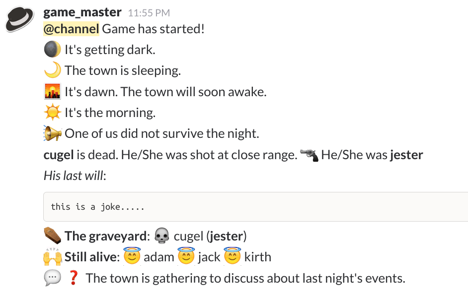
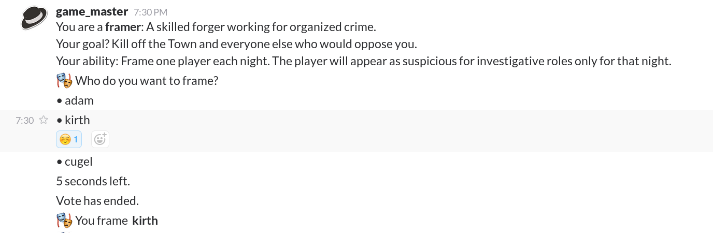

#  slack-mafia-partygame





## Description

This is a Slack-based app that acts as a game master for mafia (best known as werewolf) written in Node.js. You can find more informations on the game (rules, mechanics, roles ...) in the repo's wiki.


### Tips
- Apply this Slack theme for a better immersion:
`#101010,#101010,#D3D3CA,#BB313E,#424242,#F0F0E6,#BB313E,#BB313E`
- Open as many windows as needed (*town channel, game master channel, mafia channel, etc*) instead of switching between channels every time


## Features
- 3 factions: Town, Mafia, Neutral
- 20 roles
- Trial cycle
- Local leaderboard
- English and French supported (you can easily add other languages)
- Text-only: look busy at work while playing mafia
- Playable on your smartphone (but more challenging)

## :rotating_light: :rotating_light: Prerequisite :rotating_light: :rotating_light:

In order to run the app on your Slack, you need to create an account that will act as the game master and that account must have admin rights. Then you have to issue a test api token [here](https://api.slack.com/docs/oauth-test-tokens).  

At this time, I don't plan to make a proper Slack App (:money_with_wings:). If you are on a paid plan, you can still create a new slack team solely for mafia.

## To Use

### Setting the repo
To clone and run this repository you'll need [Git](https://git-scm.com) and [Node.js](https://nodejs.org/en/download/) (v6.9.4) (which comes with [npm](http://npmjs.com)) installed on your computer. From your command line:

```bash
# Clone this repository
git clone https://github.com/mtmvu/slack-mafia-partygame
# Go into the repository
cd slack-mafia-partygame
```
Rename `.env.default` to `.env` then open it to insert your tokens.
You can now run the npm commands:
```bash
# Install dependencies
npm install
# Build
npm run build
# Run the app
npm start
```

For development : `npm run dev`

### Starting a game
To start a new game, direct message (dm) the bot with the following commands:

```bash
!mafia init
# then players must join the town channel
!mafia newgame
!mafia start
```

### Editing settings
You can edit settings and setups in the `/src/mafia/settings/` directory

## Commands
In Slack: **direct message the bot** with theses commands:
### General commands
```bash
!mafia init # create game channels or kick everyone in them
!mafia newgame # instantiate game with players in the public town channel
!mafia start # start game
!mafia force-end <password> # delete ongoing game
!mafia leaderboard # display leaderboard
!mafia leaderboard-reset <password> # reset all scores
```

### In game commands.
```bash
!lw # show your last will
!lw <text> # replace your last will with <text>
!reveal # reveal your role to the town (doesn't work with all roles)
```

## Known Bugs

- multiple `!mafia newgame` will create a new game instance without deleting the previous ones. The only way to reset roles is to quit the app and relaunch it.
- Last will calls are not synchronous
- TypeError when game ends

## Limitations

- Only one game at a time (wip)
- Cannot implement mechanics based on private messages
- Cannot implement mechanics based on identity theft


## Improvements

- Make a desktop app (for sounds, images, ...)
- Make a proper Slack App
